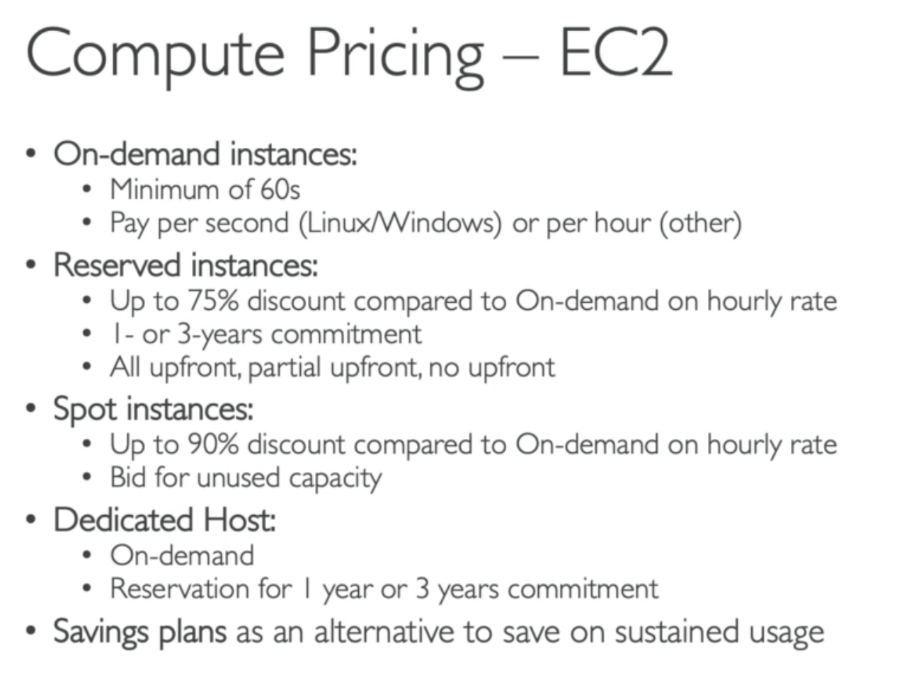
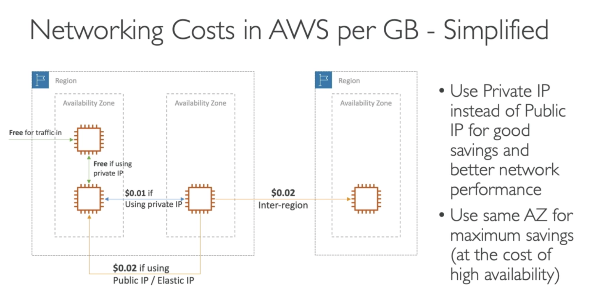

# Aws cloud practitioner (CLF-C01)

## Part 1

### Deployment models of cloud:
- Private cloud
  - Like Rackspace, cloud service used by single organization not shared to the public
  - Complete control, security sensitive, meets Specific needs
- Public cloud
  - Cloud services owned by third party providers and delivered over the internet (Aws, gcloud, azure)
  - On demand, Broad network access, multi tenant/ resource pooling, quickly scales, pay as you go
- Hybrid cloud
  - some services are on premise and some on public cloud

### Types of cloud computing
- Infrastructure as a service (IAAS)
  - Provides networking, storage and computers (highest level of flexibility)
  - Easy parallel with tradional on premise.
  - Examples: EC2, GCP, Azure, digital ocean, linode
- Platform as a service (PAAS)
  - Removes the need for your organisation to manage underlying infrastructure
  - Focus on deployment and management of applications
  - Examples: Elastic beanstalk (on aws), Heroku, Google app engine
- Software as a service (SAAS) eg: Hubspot
  - Complete product that is run and managed by the Service provider
  - Examples: Rekognition (machine learning on aws), Google apps (Gmail, Dropbox, Zoom)
- 
___

### Aws global infrastructure
  - Aws regions
  - Availability zones
  - Aws Data Centers
  - Aws Edge locations / points of presence
- Aws regions
  - All around the world (names as us-east-1, eu-west-3)
  - A region is a cluster of data centers
  - Most aws services are region scoped
  - How to choose an aws region?
    - It depends on, Compliance, Proximity/Latency, Available services, Pricing (does vary from region to region)
- Availability zones
  - Each region has many availibilty zones (usually 3, min 2, max is 6)
  - Take ap-southeast: it has 3 zones. ap-southeast-2a, ap-southeast-2b, ap-southeast-2c
  - Each availibility zone (AZ) is one or more discrete data centers with redundant power, networking and connectivity
  - They're seperate which means isolated from disasters
  - These are connected with high bandwith ultra low latency network (all zones connected form a region)
- Aws Points of presence (Edge locations)
  - 216 points of presence (205 Edge locations & 11 regional caches) in 84 cities across 42 countries (small servers that cache your data)
  - Content is delivered to end user with lowest latency to user possible
- Region scoped vs global services

### Shared responsibilty model
- Customer is reponsible for security IN the cloud
  - Customer data, IAM and access, applications, Network and firewall configuration etc
- Aws is responsible for security OF the cloud
  - Compute, database, networking, regions, hardware etc
___
### IAM - Identity and access management (Global service)
- Root account created by default
- User accounts are created in IAM 
- Group users- users can be part of multiple groups
- Permissions
  - Users or groups can be assigned JSON documents called policies
  - These policies define the permissions of the user/group
  - In Aws you apply the least priviledge principle: Don't give more permissions than a user needs
- Policies:
  - create custom inline policy or use default aws policies
- Password policy
  - Set minimum length, character required, change on first login, allow users to change pass?, require reset pass after some time 
  - MFA = Password you know + security device you own (Authy or google authenticator)
- Ways to access AWS:
  - Aws management console - (password + MFA)
  - AWS command Line  interface (CLI) - Protected by access keys
  - Aws SDK for code - - Protected by access keys
- You can use Aws cloudshell instead of installing cli on your local machine
- IAM Roles for services
  - Some services will need to perform actions on your behalf
  - To do so, we can assign **permissions** to aws service with **IAM Roles**
  - Common roles: EC2 instance roles, Lambda function roles, Roles for CloudFormation
- IAM security Tools
  - IAM credentials Report (account-level)
    - report of users and their credentials status
  - IAM access advisor (user-level)
    - Shows service permissions and show when services were last accessed.
    - You can use this info to revise policies (maybe need inline custom policy? Least priviledge)

### EC2 - Elastic Compute cloud
- Budget access/and alerts on threshold
- EC2
  - Renting virtual machines (EC2)
  - Storing data on virtual drives (EBS)
  - Distribute load across machines (ELB)
  - Scaling the services using an auto-scaling group (ASG)
  - Knowing EC2 is fundamental to understanding how the cloud works
- EC2 instance types: optimized for different use casess
- Aws uses following naming convention
  - m5.2xlarge
  - m: instance class
  - 5: instance generation (hardware)
  - 2xlarge: size within the instance class

### EC2 - Elastic Instance storage
- EBS volume (Elastic block store)
  - An EBS Volume is network attached storage drive you can attach to your instance while they run
  - Allow instance to persist data even after their termination
  - Once instance at a time
  - Bound to specific availability zone
  - Its a network drive not a physical drive
- EBS Multi volume attach feature
- volume snapshots can be moved across regions or AZ
- AMI (Amazon machine image)
  - You can make custom AMIs to create instances with pre installed packages and software (increase boot time)
- EC2 Image builder (automatically build test and distribute AMIs)
  - Used to automate the creation of Virtual machines or container images
    - Automate the creation, maintain, validate and test EC2 AMIs
- EC2 Instance store
  - EBS volumes are network drives with good but "limited" performance
  - use hardware disk for high performance (Better I/O)
  - Intance store is lost at stop or termination of instance (Ephimeral)
  - Buffer/Cache not for long term
  - Risk of failure if hardware failure
- Elastic file system (like NFS)
  - Share NFS can be mounted on 100s of EC2 instances (multi AZ network storage)
  - 3x expensive
  - Infrequent Access storage class (cost optimized for files not accessed everyday)
  - Up to 92% lower cost compared to EFS standard
  - Define lifecycle policy to automatically move files less often accessed
- Amazon FSx
  - Launch 3rd party high-performance file systems on AWS
  - Fully managed service

### Scalability and high availability
- vertical or Horizontal (elasticity)
- High availablity means your'e running your application/system in at least 2 Availability zones (AZ)
- Load balancing
  - Load balancers are servers that forward internet traffic to multiple servers (EC2 instances) downstream
  - ELB (Elastic load balancer) is a managed load balancer
    - AWS guarentees its  working, upgrades, maintainance and high availability
  - 3 kinds
    - Application load balancer HTTP/HTTPS - Layer 7
    - Network load balancer (ultra-high performance, allows for TCP) - Layer 4
    - classic (layer 4 and 7 at the same time)
- Auto scaling groups (ASG)
  - In the cloud it is very easy to create and get rid of servers, 
  - The  goal of ASG is to Scale out (add more instances) as load increases
  - Scale in (remove instances) as load decrease
  - Ensure min/max instances running
  - Register to load balancer
  - Replace unhealthy instances
- ASG strategies
  - Manual
  - Response to changing demand
    - Cloudwatch alarm, CPU/Memory or network traffic 
    - Target tracking: want all instances at 40% cpu
    - Scheduled (friday  5 to 8)
    - Predictive scaling (machine learning pattern)

### Amazon S3
- Advertised as "infinitely scaling" Object storage
- Usecases
  - Backup and Storage, Disaster recovery, archive, Hybrid cloud storage, Application/Media hosting, Data lakes and Big data, Software delivery, Static websites
- Amazon s3 allows people to store objects (files) in "bucket" (directories)
- Buckets must have a global unique name (Across all regions all accounts)
- S3 Security
  - User based: IAM policies -> which API calls should be allowed for a specific user
  - Resource based: Bucket policy (bucket wide), Object Access control list (ACL), Bucket access Control list (ACL)
  - Encryption
  - EC2 instance role
- S3 websites
  - Amazon s3 can host static websites and have them accessible on www
  - website url will be <bucket-name>.s3-website-<AWS-region>.amazonaws.com
  - Bucket has to be public or you'll get 403
  - use "static website settings" in your s3 properties   
- S3 versioning
  - Enabled at bucket level
  - You can roll back to previous version by deleting current
  - deleting objects: uses delete marker so you can restore files you haven't permanently deleted
    - delete the delete marker for restore
- S3 Access Logs
  - For audit purposes you might want to log all access to s3 buckets (any request any account authorized or denied are logged)
  - A logging bucket is used to store these logs 
- S3 replication (Cross region Replication - CRR or Same region - SRR)
  - Copying is Asynchronous
  - must enable versioning in source and destination
  - Buckets can be in different account
  - Must give proper IAM permissions
  - Create a replication rule in management (source bucket)
  - Objects already existing before you enable replication are not replicated, so upload again
- S3 storage classes
  - we were using "S3 Standard (General purpose)" so far
  - Objects can transition between storage classes 
  - use automated lifecycle configurations
- S3 object lock & Glacier vault lock
  - Object lock
    - WORM lock (write once read many) model
    - Block an object version deletion for a specified amount of time
  - Glacier Vault lock
    - WORM
    - Lock the policy future edits (for compliance lets say audit after 7 years)
- S3 Snow family
  - Highly secure, portable devices to **collect and process data at the edge, and migrate date in & out of aws**
  - Data migration
    - Snowcone (small device 8TB), Snowball edge (42 TB or 80TB hardware box) & Snowmobile (its an actual truck 1 Exabyte)
  - Edge computing
    - Snowcone and Snowball edge
  - Rule: if it takes more than a week to transfer data over the network, use snowball devices!
  - Opshub is desktop application to manage snow family devices

- Aws storage gateway (EBS, s3 and glacier can use aws storage gateway)
  - Hybrid AWS service used to allow on-premises servers to seamlessly use the AWS Cloud at the storage layer
  - Bridge b/w on-premise data and cloud data in s3
  - Seamlessly connect the aws cloud with your on premise setup

### Aws databases & analytics
- Relational and NoSQL
- AWS RDS (relational database serivce) is a DB service which can be used to create databases managed by aws
  - Postgres, SQL, MariaDB, Oracle, Microsoft SQL
  - Aurora (aws proprietary Database)
  - Replicas and Multi AZ setup for DR, scalable
  - Maintenance and patching by aws
  - BUT you cant ssh into server
- RDS deployments: Multi-AZ
  - **Read replicas** upto 5 (data is written to only the main DB)
  - **Multi AZ** Failover in case of main db outage
  - **Multi region** read only replcas (higher cost)
- Amazon Elastic cache (redis/memcache)
 - AWS managed takes care of all the monitoring, patching, configuration, backups and faulure recovery
- DynamoDB (NoSQL)
  - Fully managed "serverless" replicated across 3 AZ and low latency
  - Integrated with IAM for security
  - DynamoDB Accelerator - DAX
    - In memory cache for dynamoDB
    - 10x performance - single digit milisecond to microsecond latency
  - DynamoDB Global tables
    - make a table accessible with **low latency** in multiple-regions
    - two way replication between 2 tables (read/write to any region)
- Redshift
  - Based on postgres but it isnt OLTP it is used for OLAP - online analytical processing (analytics and data warehousing)
  - Load data every hour instead of every second
  - 10x better performace than other warehouses, scales to Petabytes of data
  - Columnar storage of data (instead of row based)
- Amazon EMR (Elastic MapReduce)
  - Helps create hadoop clusters (big data) to analyze and process vast amount of data
  - hundreds of EC2 instances (also supports Apache spark, Hbase, presto, flink)
  - EMR takes care of provisioning all
- Amazon Athena
  - Serverless query service to perform analytics against S3 objects
  - uses standard SQL language to query the files
  - Supports CSV, JSON, ORC, Avro, and Parquet (build on presto)
  - $5 per TB of data scanned
- Amazon quicksite
  - Serverless machine learning-powered BI service to create interactive dashboard (like grafana)
  - Integrated with RDS, Aurora, Athena, Redshift s3
- Document DB
  - Same as Aurora for SQL databases, Document DB is same for mongoDB
- Naptune
  - Fully managed graph database (social network)
  - Highly available across 3 AZs and upto 15 read replicas
- QLDB (Quantum ledger Database) (centralized blockchain)
  - A ledger book recording financial transactions
  - Fully manages replication across 3 AZ
  - Immuatable, Crytographically verifiable
  - 2-3x better performacne than common ledger blockchain frameworks, manipulate data using SQL 
  - Difference with Amazon Managed blockchain: no decentralization component
- Amazon managed blockchain (decentralized blockchain)
  - Amazon managed service to join public blockchain networks or create your own scalable private network
  - Compatible with Hyper ledger Fabric and ethereum
- DMS (Database migration service)
  - Quickly and securely migrate databases to AWS, resilient, self healing
  - The source database remains available during migration
- AWS Glue (ETL service)
  - Managed Extract, transform and Load (ETL) service
  - Prepare and transform data for analytics
  - Fully serverless
  - **AWS Glue Data Catalog** is a central repository to store structural and operational metadata for all your data assets. For a given data set, you can store its table definition, physical location, add business relevant attributes, as well as track how this data has changed over time.

- 

___

## Part 2

### Other Compute Services: ECS, Lambda, Batch, Lightsail
- Amazon ECR (Elastic container registry) - (private docker registry)
- ECS (Elastic container service)
  - Launch docker containers on aws, you must provision and maintain infrastructure (i.e EC2 instances)
  - Takes care of starting/stopping containers/ Has application load balancer
- Fargate
  - Used to launch docker containers but also manages underlying infrastructure (no ec2 instances to manager - Simpler!)
  - serverless offering
  - Use ECR with fargate to pull and run images
- Aws Lambda
  - Virtual functions - no servers to manage
  - Limited by time - Short executions
  - Run on demand; auto scale
  - Pay per requests
  - Free tier 1,000,000 Aws lambda request and 400,000 GBs of compute time
  - Integrated with whole lot of aws services
  - Event driven: functions get invoked by aws when needed
  - cloudwatch
  - Upto 10GB to RAM per function (Increasing RAM will also improve Network and CPU)
  - Lambda supports many languages, custom Runtime API and Lambda Container image (container must implement lambda runtime API)
  - Billing
    - By time run X By RAM provisioned
    - By the number of invocations
- Amazon API Gateway
  - Expose aws services
  - Fully managed service for developers to easily create, publish, maintain, monitor and secure APIs
  - Serverless and scalable
  - Supports RESTful apis and websocket APIs
  - Security, User auth. API throttling. API Keys, monitoring
- AWS Batch
  - Fully managed Batch processing service at any scale
  - Efficiently run 100,000s of computing batch jobs on AWS
  - A "batch" job is a job that has a start and an end (opposed to continous)
  - Batch will dynamically launch **EC2 instances** or **spot instances**
  - Has a batch queue
  - Batch jobs are defined as Docker images and run on ECS
- Amazon Lightsail (standalone service)
  - Virtual servers, storage, databases and networking in one place
  - Low and predictable pricing
  - Simpler alternative to using EC2, RDS, ELB, EBS, Route 53...
  - Great for people who have little cloud experience
  - Templates available for deplying stacks (MEAN, LAMP, Nginx etc)
    - Websites like wordpress, magento, Plesk, joomla
    - Dev and test environment
  - High availability but no auto-scaling, limited aws integrations

___

### Deploying and managing infrastructure at scale
- Cloudformation
  - Declarative way of outlining your AWS insfrastructure, for any resources (most of them are supported)
  - Benefits: Infra as code, cost (check bill estimate)
  - Diagrams
  - Use templates (Don't reinvent the wheel)
  - Use "custom resource" for resources that are not supported
  - very useful when you want to repeat architechture in multiple/different environments
- AWS Cloud Development kit (CDK)
  - Deploy your infrastructure with a familiar laguage (Js/ts. python, java and .Net)
  - The code is compiled into a cloudFormation template (JSON/YAML)
  - Therefore you can deploy infra as well as application runtime code together 
    - Great for Lambda functions and Docker containers in ECS / EKS.
- Elastic beanstalk 
  - Developer centric view of deploying an application on AWS
  - It uses all the components we've seen before
    - EC2, ASG, ELB, RDS etc (all in one view)
  - It is a Platform as a service (PAAS)
  - Three architechture models
    - single instance (dev)
    - LB + ASG: great for production or pre production web apps
    - ASG only (for workers)
  - Supports a whole lot of languages and docker (or you can write your own platform)
  - Beanstalk has its own health monitoring
  - Uses cloudformation at the back to provision the infrastructure
- CodeDeploy
  - We want to deploy our application automatically
  - Works with EC2, and on premise server
  - Its a hybrid service
  - You must provision the servers/instances ahead of time with the codedeploy agent
- CodeCommit
  - Code repository like github
  - Aws' own offering for source control (makes it easy to collaborate) 
  - Fully managed, Scalable and highly available, private and integrated with aws
- CodeBuild
  - code building service in the cloud
  - Compile code, run tests and produce packages (then deploy with codedeploy)
  - serverless, produce ready to build artifacts
  - Pay as you go
- CodePipeline (CI/CD)
  - Orchestrate Code => Build => Test => Provision => Deploy
  - Fully managed and compatibility with so many aws services
- CodeArtifacts
  - Software packages like npm (also called code dependencies)
  - Secure, cost effective scalable (works with common dependency management tools like yarn, maven, Gradle, npm, pip, Nuget)
  - Developers and codeBuild can retreive dependencies directly from codeArtiacts 
- CodeStar
  - Unified UI to easily manage software development activities in one place
  - Quickway to setup CodeCommit, CodeDeploy, CodeBuild, CodePipeline, elastic Beanstalk, EC2
  - Can edit code "in the cloud" with cloud9
- Aws cloud9
  - Cloud IDE for writing, running and debugging code
  - Code collaboration in realtime
- Aws systems manager (SSM)
  - Helps you manage your aws ec2 and on premise systems at scale
  - Another hybrid service (get operational insights)
  - Suite of 10+ products
    - Patching automation for enhanced compliance
    - Run commands across an entire suite of servers
    - Store parameter conf with SSM Parameter store
  - Works for both windows and linux servers
  - SSM agent needs to be installed first
  - SSM session manager can be used to access EC2 instance without port 22 open
- AWS opsworks
  - Managed chef & puppet
  - Alternate to AWS SSM
  - Chef and puppet to perform server configurations automatically or repetitive

### Leveraging AWS global Infrastructure
- Global DNS - Route 53
  - Managed DNS
  - Route users to the closest deployment with least latency
  - Routing policies
    - simple routing policy, weighted routing policy (assign weights to the ec2 instance)
    - Latency routing policy (redirected to the closest server)
    - failover routing policy (primary/failover servers)
    - Cloudfront origins
      - S3 buckets
      - Custom origin (Ec2 instance, s3 website, any HTTP backend, app load balancer)
- Global content delivery network (CDN) - Cloudfront
  - 216 parts of edge locations
  - Replicate parts of application to aws edge locations (decrease latency)
  - Cache common requests
- S3 Transfer acceleration
  - Improve global uploads/downloads
  - Increase transfer speed by transferring file to an AWS edge location which will forward the data to the s3 bucket in the target region
- Aws Global Accelerator
  - Improve global availability and performance using the AWS global network

- AWS Outpost
  - Outposts are server racks that offers the same AWS infrastructure, Services, apis & tools to build app on premise
  - AWS will come and setup/manage your on premise server racks.
  - You are now responsible for security and physical hardware damage
- AWS Wavelength
  - Wavelength zones are services to the edge of the 5G networks
  - Ultra low latency through 5g networks
  - Connected to parent regions 
  - No additional charges 
  - Use cases: Smart cities, ML assisted diagnostics, connected Vehicles, Interactive live streams, AR/VR
- AWS localzones
  - Place aws compute, storage, database, and other selected services closer to end users to run latency-sensitive apps
  - Extend you VPC to more locations - Extension of an AWS region
- AWS global Application architecture
  - Single region, Single AZ
  - Single region, Multi AZ
  - Multi region, active/passive
  - Multi region, active/active

### Cloud integrations
- Amazon SQS (Simple Queue Service)
  - Serverless, fully managed (10 year old service)
  - 1 message per second to 10,000s per second
  - Producers --> Queue  --> Consumers (Pub/Sub)
  - Low latency
- Amazon SNS (Simple notification service)
  - What if you want to send one message to many receivers?
  - "event publishers" Send message to an SNS topic
  - As many "event subscribers" to listen to SNS topic
  - 10,000,000 subsciptions per topic, 10,000 topics limit
  - SNS subscribers can be
    - HTTP/HTTPS
    - Emails, SMS messages, Mobile notifications
    - SQS queues, lambda functions
- Amazon Kinesis (big data streaming)
  - Kinesis = real-time big data streaming
  - Managed service to collect, process and analyze real-time data streaming at any scale
  - Kinesis data Streams
    - Low latency stream to ingest data at scale from hundres of sources
  - Kinesis data firehose
    - load stream into s3, redshift, elasticsearch etc
  - Kinesis data analytics
    - Perform real time analysis on streams using SQL
  - Kinesis video stream (video streams for ML)
- Amazon MQ (Managed Apache ActiveMQ)
  - Doesn't scale as SQS/SNS
  - Not serverless
  - Both queue features (SQS) and topic features (SNS)
 

### Cloud monitoring
- Cloudwatch metrics
  - EC2 instances, EBS volumes, s3 ...
- Cloudwatch alarms
  - Trigger notification for any metric
  - Alarm action
    - auto scale. EC2 actions, SNS notifications
  - Billing alarms are only available in us-east-1
- Cloudwatch logs
  - Collect logs from
    - Elastic beanstalk, ECS, Lambda, CloudTrail, cloud agents on Ec2/on premise, route 53
  - Enable real time monitoring of logs
  - Adjustable log retention
- Cloudwatch Events
  - Schedule: cron jobs
    - Trigger script on lambda function
  - Event pattern: Event rules to react to a service doing something
  - Trigger lambda, send SNS/SQS ...
- Event Bridge
  - Next evolution of Cloudwatch events
  - Default event bus (aws service)
  - Partner event bus (SAAS outside aws eg: Datadog, segment, Auth0)
  - Custom event bus (for you own app)
  - Schema registry
- AWS cloudTrail (90 days retention)
  - Provides governance, compliance and audit for your AWS account
  - Enabled by default
  - Get history of events/API calls made within your AWS account by:
    - console, SDK, CLI, AWS services
  - Put logs into cloudwatch logs or s3
  - Apply to all or single region
  - Management events (enabled by default)
  - Data events (not enabled by default b/c lot of volume)
  - Cloudtrail insights
    - Detect unusual activiy (paid service) - AI
- AWS x-ray (debugging apps)
  - Visual analysis of your application
  - Advantages
    - Troubleshooting performance (bottlenecks)
    - Understand dependencies in a microservice architecture
    - Pinpoint service issues
    - Review request behavior (meeting SLA service level agreement)
    - Identify impacted users
- Amazon CodeGuru
  - An ML-powered service for automated code reviews and application performance recommendations
  - Reviewer and profiler 
- Amazon service health dashboard
  - shows all regions, all services health
  - Shows historical information for each day
  - Subscribe RSS feed
- Amazon Personal health dashboard
  - PHD gives you personalised view into the performance and availability of the all the services your'e using

### VPC and Networking
- VPC, subnets, internet gateways & NAT gateways
- Security groups, Network ACL (NACL), VPC flow logs
- VPC peering, VPC endpoints
- Site to Site VPN & Direct connect
- Transit gateways
- Lets start
- VPC (Virtual Private cloud)
  - Subets (partition your network inside your VPC)
  - Public Subnet (accessible from the internet)
  - Private subnet (Not accessible from the internet)
  - Use **Route tables** to define subnets
- Internet Gateways
  - Helps your VPC instances to connect with the internet
  - Public subnets have a route to the Internet Gateway
  - **NAT Gateways** (Aws managed) & **NAT Instances** (self managed) allow your instances in your **Private Subnets** to access the internet while staying private
- NACL (Network Access control list)
  - A firewall which controls traffic from and to subnet
  - Can have ALLOW and DENY rules, Rules only include IP Addresses
  - Are attached at the subnet level
- Security Groups
  - A firewall that controls traffic to and from an ENI / an EC2 instance
  - Can only have ALLOW rules, Rules include IP addresses and other Security groups
- VPC flow logs
  - Capture info about IP traffic going into your interfaces
  - VPC FLow logs, Subnet flow logs, Elastic network interface flow logs
  - Helps to monitor and troubleshoot connectivity issues. Example
    - Subnets to internet, subnets to subnets, Internet to subnets
  - Capture info from AWS managed services as well, Elastic cache, aurora, ELB etc
  - Export logs into s3 or cloudwatch logs
- VPC Peering
  - Connect 2 VPS privately using AWS' network (behave as if they're in the same Network)
  - IP range must not overlap
- VPC Endpoints
  - Endpoints allow you to connect to AWS Services **Using a private network** instead of public www network.
  - This gives you enhanced security and lower latency to access AWS services.
  - VPC endpoint Gateway: S3 and dynamo DB
  - VPC endpoint Interface: the rest api (any aws service that supports it)
- Site to Site VPN & Direct connect
  - Site to Site VPN (encrypted connected goes over the internet)
    - On-premise: Must use a Customer Gateway (CGW)
    - AWS: must use a Virtual Private Gateway (VGW)
  - Direct connect DX (Establish a physical connection between on premise and AWS)
    - Takes at least a month to establish this
- Transit Gateway
  - Network topology can get a bit complicated
  - New aws service Transit Gateway
    - Having a transitive peering between thousands of VPC and on-premise, hub-and-spoke (star) connection
    - One single gateway sits in the middle (works with VPCs, DX, VPN)

___

## Part 3

### Security and Compliance
- Aws responsibility (security of the cloud)
  - Protecting infra (Hardware, software, facilities, and networking)
  - Managed services
- Your Responsibility (security in the cloud)
  - For Ec2 customer resp for guest OS (security and updates), firewall and IAM roles
  - Encrypting app data
- Shared controls
  - Patch management, conf management, awareness and training

- DDOS (Distributed Denial of service) Protection
  - AWS shield standard: For all customers, no cost
  - AWS shield advanced: 24/7 premium protection
  - AWS WAF (Web app firewall): filter specific requests
  - Cloudfront and Route 53 (edge locations combined with AWS shield)
- Penetrating testing on aws
  - AWS customers are welcomed to carry out security assessments or pen tests against their AWS infra without prior approval for 8 services
    - EC2, NAT Gateways and ELB
    - RDS, cloudfront, aurora, API Gateways, Lambda and lambda edge functions, Lightsail, Elastic beanstalk environments
- AWS encrytion with KMS & CloudHSM
  - KMS (key management service)
    - keys used to encrypt data at rest/transit
    - AWS manages the software
  - CloudHSM (hardware security module)
    - Encrytion hardware is from AWS but you manage keys yourself
- AWS Certificate manager (ACM)
  - Easily provision, manage and deploy SSL/TLS Certificates
  - Used to provide in-flight encryption for websites (HTTPS)
  - Supports both public and private TLS certificates
  - Free of charge, automatic renewal
  - Integration (load certificates on)
    - ELB, Cloudfront, APis on API Gateways
- Secrets manager
  - Newest service, meant for storing secrets
  - force rotation after x days
  - Automate generation of secrets on rotation
  - Integration with RDS (MYSQL, aurora, Postgres)
  - Encrypted with KMS
- AWS Artifact (Not really a service)
  - Portal provides on demand aws compliance doc and agreements
  - Artifact reports
  - Artiface agreements
  - Support internal audit or compliance
- Amazon GuardDuty
  - Intelligent Threat discovery to protect aws account
  - Uses ML, anamoly detection, 3rd party data
  - One click enable (30 day trial)
  - Input data includes
    - VPC flow logs, Cloudtrial logs, DNS Logs (AWS DNS)
- Amazon inspector
  - Automated security assessments for EC2
  - Analyze OS for known vulnerability and unintended network accessibility
  - AWS inspector agent must be installed on OS in EC2 instances
- AWS config
  - Helps auditing/recording compliance of your AWS resources
  - Helps record configuration and changes over time
  - Possibility of storing the configuration data in S3
- AWS Macie (Discover PII)
  - Fully managed data security and data privacy service that uses ML and pattern matching to discover and protect sensitive data in AWS
  - Macie helps identify and alert you of sensitive Data such as PII
- AWS Security Hub
  - Central security tool to manage security across several AWS accounts and automate security checks
  - Integrated dashboards to show current security and compliance status to quikly take actions
  - auto aggregate
    - GuardDuty, Inspector, Macie, IAM Access manager, AWS systems Manager, AWS Firewall, AWS partner network
  - Must first enable aws config service
- Amazon Detective service
  - Sometime findings require Deeper analysis to isolate the root cause and take action
  - Analyzes, investigates and quickly identifies the root cause of the security issues or suspicious aciticites (using ML and graphs)
- AWS abuse
  - Report suspected aws resources used for abusive or illegal purposes
  - Spam, Port scannning, DDOS, Intrusion, Hosting objectionable or copyright content, distributing malware
  - abuse@amazonaws.com
- Root user priviledges
  - Root user = Account owner (has complete access to all aws services and resources)
  - Lock away your AWS account root user access keys!
  - Do not use for everyday activity

___

### Machine learning
- Amazon Rekognition
  - Find objects, people, text, scenes in images and videos using ML
  - Facial analysis and facial search to do user verification, people counting
  - Create a db of "familiar faces" or compare against celebrities
  - Use cases:
    - Labelling, Content moderation, Text detection, Face detection, pathing (see where everyone is going eg: football game)
- Amazon Transcribe
  - Convert speech into text (uses deep learning)
- Polly (Opposite of transcribe)
  - Turn text into speech
  - Allowing you to create application that talk
- Amazon translate
  - Natural and accurate **language translation**
- Amazon Lex (same tech powers alexa) & Connect
  - Amazon Lex: Auto speech recognition (ASR) to convert speech to text
  - Natural lanugage understanding to recognize the intent of text, callers
  - Helps build chatbots, call center bots
  - Amazon connect
    - Virtual call center
    - Can connect with other CRM systems for AWS
    - No upfront payment, 80% cheaper than traditional contact center
- Amazon comprehend
  - For natural language processing - NLP
  - Uses ML to find insights and relationships in text
    - Language to text, Extract key phrases, places, brands or events
    - Sentimental analysis
    - Find topics by organizing text
  - Use cases:
    - Analyze customer interactions
- Amazon SageMaker
  - Fully managed service for dev/data scientist to build ML models
  - Difficult to do all the processes in one places + provision server
  - Label data --> Build model --> Train and tune --> deploy and manage
- Amazon Forecast
  - Fully managed service that uses ML to deliver highly accurate forecasts
  - Example: predict the future sales of a raincoat
  - 50% more accurate than looking at data itself
  - use cases: product demand planning, Financial planning, Resource planning
- Amazon Kendra
  - Fully managed **Document search service** powered by ML
  - Extract answers from within a document (text, pdfs, HTML, Powerpoint, MS word, ...)
  - Natural language search capability on the data
  - Learn from user interactions/feedback to promote preferred results (incremental learning)
- Amazon Personalize
  - Fully managed ML-service to build apps with real-time personalized recommendations
  - Example: personalized product recommendations/re-ranking, customized direct marketing
  - Same tech used by Amazon.com
  - use case: build very quickly, retail stores, media and entertainment

### Account management, Billing and Support
- AWS organizations (Global service)
  - Allow to manage multiple aws accounts
  - Main account is called the master account
  - Cost Benefits:
    - Consolidated billing across all accounts
    - Pricing benefits (aggregate usage)
  - API is available to automate aws account creation
  - Restrict account priviledges using **Service Control policies** (SCP)
  - Multi account vs One account multi VPC
  - Organization Units (OU)
    - Dev/test/prod, department wise (Finance/sales etc)
  - Service control policies (SCP)
    - Whitelist or blacklist IAM actions
    - Applied at OU or account level (even the root user)
    - Does not apply on master account
  - Policies are inherited from organization structure

- Organization Consoloidated Billing
  - **Combine usage** - share the volume pricing, reserved instances and savings Plans discount
  - One Bill - Get one bill for all accounts in the organization
- AWS Control Tower
  - Easy way to set up and govern a secure and compliant multi-account AWS ennvironment based on best practices
  - Benefits:
    - Automate set up of your environment in a few clicks
    - Automate ongoing policy management using guardrails
    - Detect policy voilations and redediate them
    - Monitor compliance through an interactive dashboard
  - Runs on top of aws organizations
    - Automatically sets up AWS org to organize accounts and implement SCPs (Service control Policies)
- Pricing models in AWS
  - 4 pricing models
    - Pay as you go (agile, responsive, meet scale demands)
    - Save When you reserve (long term requirement)
    - Pay less by using (volume based discount)
    - Pay less as AWS grows (cost reduction every month/year)
  - Compute Pricing - EC2
    - Only charged for what you use
    - Number of instances
    - Instance configuration
      - Physical capacity
      - Region
      - OS and software
      - Instance type/size
    - ELB running time and amount of data processed
    - Detailed monitoring
    
  - AWS lambda & ECS
    - Lambda
      - Pay per call
      - Pay per duration
    - ECS
      - EC2 launch type model: No additional fees, you pay for AWS resources stored and created in your application
    - Fargate
      - Pay for vCPU and memory allocated in your containers
  - S3 pricing
    
  - EBS
    - Volume type
    - Storage In GB per month
    - IOPS
    - Snapshots (GB per month)
    - Data inbound is free outbound is paid
  - RDS
    - Per hour billing
    - Database characteristic (Engine, Size, Memory class)
    - Purchase type (on demand or reserverd 1-3 year)
    - Backup storage is upto 100% free
    - Additional storage (per GB per month)
    - Number of input/output requests per month
    - Deployment type (single/multi AZ) (pay for 2 RDS dbs)
    - Data transfer: inbound free outbound is paid
  - Cloudfront
    - Pricing is different across different geographical regions
    - Data transfer out is paid, inbound is free
    - Aggregated for each edge location, then applied to your bill
    - Number of HTTP/HTTPS requests
  - Network costs in AWS per GB   
    
- Savings plan
  - Commit to a certain $ amount per hour for 1 or 3 years
  - Easiest way to setup long-term commitments on AWS
  - EC2 Savings plan
    - upto 72% discount compared to on demand
    - Commit to usage of individual instance family in a region (eg: C2 or M5)
    - Regardless of AZ, size, OS and tenancy
  - Compute savings plan
    - 66% discount as compared to on demand
    - Regardless of Family, region, size, OS tenancy, compute options
    - Compute options: EC2, Fargate, Lambda
- AWS compute optimizer
  - Reduce Cost and Improve performance by recommending optimal AWS resources for your workloads
  - Help you choose optimal configuration (over/under provisioned)
  - Uses machine learning to analyze your resources' conf and their utilization in the cloudwatch metrics
  - Supported resources:
    - EC2, EC2 ASG, EBS volumes, Lambda
  - Lower cost by 25%
  - Export recommendations to s3

- Amazon Total cost of ownership (TCO) Calculators
  - AWS helps you reduce total cost of ownership by reducing need to invest in large capitals and provdes Pay as you go model
  - The TCO calculators allow you to estimate the cost savings when using AWS and provide detailed report to use in executive presentations
  - Compare the cost of on premise vs AWS server, storage, Network, IT labor
- Simple monthly calculator (deprecated)
  - Replaced by AWS Pricing calculator
  - Estimate cost of your architecture solution

- AWS Billing dashboard
  - See forcasted and usage breakdown, Free tier services usage
  - Cost allocation tags
    - Track and group aws costs on the detailed level
  - AWS generated tags and user generated tags

- Cost explorer
  - Visualize understand and manage your AWS cost and usage over time
  - Create custom reports that analyze cost and usage data
  - High level across all account or monthly/hourly, resource level graularity
  - Choose an optimal savings plan
  - Forecast up to 12 months usage based on previous usage

- Billing alarms in cloudwatch (Billing metric stored in **us-east-1**)
- AWS budgets (Send alarms when cost exceed budget)
  - 3 types: Usage, Cost, Reservation
  - Upto 5 SNS notifications per budget
  - Filter by service, AZ, API, operation etc
  - 2 budgets are free then $0.02 per budget per day per budget 

- AWS Trusted advisor
  - No need to install anything - high level AWS account assessment 
  - Analyze and provide recommendations on 5 categories
    - Cost optimization
    - Performance
    - Security
    - Fault tolerance
    - Service limits
    

- AWS support Plans Pricing (4 plans)
  - Basic support (default free)
  - Developer ($29)
  - Business
  - Enterprise

### Advanced identity
- AWS STS (Security token service)
  - Create temporary, limited privileges credentials to access your AWS resources
  - Short-term credentials: you configure expiration period
  - Use cases:
    - **Identity federation**: manage user identities in External systems and provide them with STS token to access AWS resources
    - **IAM Roles for cross/same account access**
    - IAM roles for EC2
- Amazon cognito
  - Identity for web and mobile app users
  - Instead of creating them an IAM user, you create a user in incognito

- AWS directory services
  - Microsoft active directory (AD)
    - Found on windows server with AD Domain services
    - Database of objects, User Accounts, Computers, Printers file shares, Security groups
    - Centralized security management, Create account, assign permissions
  - AWS managed microsoft AD (use AD connector)
  - Simple AD (microsoft competitor)

- AWS single sign on (SSO)
  - Centrally managed SSO to access Multiple accounts and 3rd party business apps
  - Integrated with AWS organizations
  - Supports SAML 2.0 markup
  - Integrate with on premise AD 
___

### Other AWS services
- Amazon workspaces
  - Managed Desktop as a service (DAAS)
  - Eliminate managment of on premise VDI
- Amazon Appstream 2.0
  - Desktop application streaming service
  - Without acquiring, provisioning infrastructure, The app is delivered from within the browser
- Amazon sumerian
  - Create and run Virtual Reality (VR), Augmented reality (AR) and 3D applications
  - Can be used to quickly create 3D models with animations (Ready to use template, no programming required)
  - Access with web browser or AR VR headset
- AWS IOT core
  - Collect and transfer data, easily connect IoT devices to the aws cloud
  - serverless secure & scalable
  - Integrate with aws services
- Amazon Elastic transcoder
  - Convert media files stored in s3 into required consumer playback format (mobile etc)
- AWS device Farm
  - Fully managed service that tests your web and mobile apps against desktop browser, real mobile devices and tablets
  - Run tests concurrently on multiple devices
  - Configure devices
  - Real farm of devices (not virtual)
- AWS Backup
  - Fully managed to centrally manage and automate backups across aws services
  - On-Demand and scheduled backups
  - Supports PITR (Point in time recovery)
- Disaster recovery Strategies
  - Backup and restore (cheapest)
  - Pilot light (minimal required component, ready to scale)
  - Warm standby (full version of the app ready at minimum size)
  - Multi site / hot site (full version of the app at full size)
- CloudEndure Disaster recovery
  - Easily recover your physical, virtual and cloud based server into AWS
  - Continous block level replication for your servers
- AWS DataSync
  - Move large amount of data from on premise to AWS
  - Can synchornize to: S3, Amazon EFS, FSx for windows
  - The replication is **incremental** after full load
- AWS Fault Injection Simulator (FIS)
  - A fully managed service to run fault injection test on aws workloads
  - Based on **Chaos Engineering** - Stressing an application by creating disruptive events (eg: sudden Increase in CPU or memory) and observe the system response.
  - Supports: EC2, EKS, ECS, RDS

### AWS Architecting & Ecosystem
- General Guiding Principles
  - Stop guessing your capacity needs (use auto scale based on demand)
  - Test system at production
  - Automate and make architectural expirements easier
    - Desgin based on changing requirements
  - Improve through game day
- Design Principle:
  - Scalability
  - Disposable Resources
  - Automation - (Serverless, IAAS, auto scaling) 
  - Loose coupling
  - Services, not servers
    - Dont do everything EC2
    - Find managed services, databases, serverless etc
- 6 Pillars of well architected Framework (https://aws.amazon.com/blogs/apn/the-6-pillars-of-the-aws-well-architected-framework/)
  1. Operational Excellence
  2. Security
  3. Reliability
  4. Performance Efficiency
  5. Cost optimization
  6. Sustainability
- AWS Well-Architected tool
  - Free tool to **Review your architectures** against the 5 pillar and **adobt best practices**
- AWS Right sizing
  - Match instance size with your workload at the lowest possible cost
  - Scalling up is easy so always start small
  - Its important to right size:
    - Before a cloud migration
    - Continously after the cloud onboarding process
- AWS Ecosystem – Free resources
  • AWS Blogs: https://aws.amazon.com/blogs/aws/
  • AWS Forums (community): https://forums.aws.amazon.com/index.jspa • AWS Whitepapers & Guides: https://aws.amazon.com/whitepapers
  • AWS Quick Starts: https://aws.amazon.com/quickstart/
  • Automated, gold-standard deployments in the AWS Cloud
  • Build your production environment quickly with templates
  • Example:WordPress on AWS https://fwd.aws/P3yyv?did=qs_card&trk=qs_card • Leverages CloudFormation
  • AWS Solutions: https://aws.amazon.com/solutions/
  • Vetted Technology Solutions for the AWS Cloud
  • Example - AWS Landing Zone: secure, multi-account AWS environment
  • https://aws.amazon.com/solutions/implementations/aws-landing-zone/ • “Replaced”byAWSControlTower

- AWS Ecosystem - AWS Support
  - DEVELOPER
    • Business hours email access to Cloud Support Associates 
    • General guidance: < 24 business hours
    • System impaired: < 12 business hours
  - BUSINESS 
    • Production system impaired: < 4 hours
    • 24x7 phone, email, and chat access to Cloud Support Engineers 
    • Production system down: < 1 hour
  - ENTERPRISE 
    • Access to a Technical Account Manager (TAM)
    • Concierge Support Team (for billing and account best practices)
    • Production system impaired: < 4 hours
    • Production system down: < 1 hour
    • Business-critical system down: < 15 minutes

- AWS knowledege center (https://aws.amazon.com/premiumsupport/knowledge-center/)

___
Resources:
https://www.udemy.com/course/aws-certified-cloud-practitioner-new/learn/l
